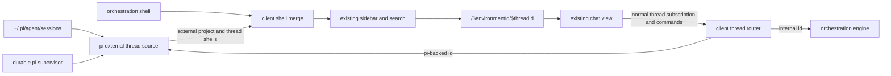
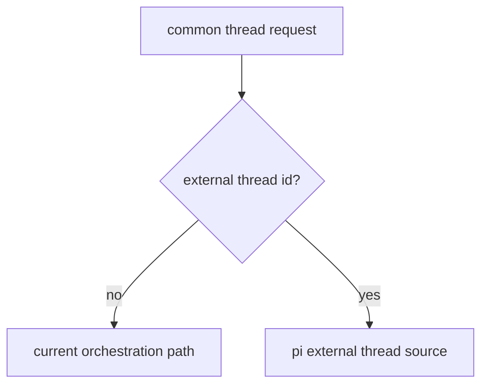

# native pi as external-backed threads

## status

implemented as an external-backed thread source. the rejected standalone native
pi screens and routes have been removed.

## goal

native pi sessions should feel like ordinary t3 threads. they appear in the
existing project sidebar, open the existing chat route, render through the
existing timeline, and use the existing composer. their only meaningful
difference is ownership: pi jsonl stores history and a host-local supervisor
owns control.

the implementation must not create a second product surface to expose that
difference.

## invariants

1. `~/.pi/agent/sessions` is authoritative for native pi history.
2. native history creates no orchestration thread, message, event, or activity
   rows in sqlite.
3. clients never receive canonical session paths.
4. internal and native threads share the same client-facing shell, detail,
   stream, route, timeline, and composer models.
5. source selection happens at the server boundary, not in chat components.
6. each canonical pi session has at most one supervisor-registered writer.
   an unbridged terminal writer remains invisible, so guarded takeover reduces
   accidental concurrency but cannot eliminate it.
7. t3 server restarts and client disconnects do not stop supervisor-owned pi
   processes.
8. stable command ids survive retries. a command whose delivery began before a
   supervisor crash remains indeterminate until pi supports durable command-id
   acknowledgements.
9. unsupported mutations are disabled through capabilities, not hidden in a
   separate UI.

## product shape



there is no `/pi` route, native pi sidebar destination, native pi timeline, or
native pi composer.

## ownership boundary

native pi is an **external-backed thread source**, not another provider adapter.

the existing pi provider adapter is correct for t3-owned sessions: provider
events enter orchestration and sqlite becomes the read model. native sessions
reverse that ownership. routing them through the adapter would either copy
history into sqlite or create two writers.

“external-backed” describes durable ownership. “virtual thread” is avoided
because these sessions are neither temporary nor client-local.

## common thread contract

`OrchestrationThreadShell` and `OrchestrationThread` gain optional backing
metadata. absence preserves current internal behavior.

```ts
interface ExternalThreadBacking {
  readonly kind: "external";
  readonly source: "pi";
  readonly sourceKey: string;
  readonly control: "live" | "resumable" | "readOnly";
  readonly capabilities: {
    readonly send: boolean;
    readonly attachments: boolean;
    readonly streamingBehaviors: readonly ("steer" | "followUp")[];
    readonly interrupt: boolean;
    readonly stop: boolean;
    readonly rename: boolean;
    readonly archive: boolean;
    readonly delete: boolean;
    readonly changeModel: boolean;
    readonly changeRuntimeMode: boolean;
    readonly changeInteractionMode: boolean;
    readonly checkpoints: boolean;
  };
}
```

capabilities are authoritative. v1 supports text send, steer, follow-up,
interrupt, and supervisor stop when the writer is controlled. image attachments
remain disabled until external jsonl images have an authenticated asset
resolver. rename, archive, delete, model changes, runtime-mode changes,
interaction-mode changes, and checkpoints remain disabled.

`thread.turn.start` accepts an optional `streamingBehavior` of `steer` or
`followUp`. internal threads reject it when unsupported. external routing maps
it to pi's prompt queue behavior.

client-visible pi contracts are transport-only:

- catalog subscription for external project and thread shells
- create native session in a cwd
- supervisor runtime state and command receipts

normal thread detail, subscription, and command endpoints remain the public
chat API. raw `sessionFile` values never cross it.

## identity

thread identity is an opaque sha-256 hash of the canonical session path. this
keeps identity stable when a duplicate session uuid appears or disappears.
moving a session file changes its thread identity.

derived identities are deterministic:

- unmatched project: hash of canonical cwd
- message: session id plus jsonl entry id
- turn: active-branch user-message id
- activity: session id plus entry id or runtime sequence

determinism lets reconnect snapshots replace transient state without duplicating
timeline items.

## discovery and project association

the catalog reads bounded jsonl metadata and emits lightweight shells. it
associates each session in this order:

sessions whose header declares `parentSession` are excluded. remote delegate
runtimes that cannot preserve that path are recognized by the delegate
extension's initial `Delegated task:` protocol marker. recognized agent-backed
tool calls are represented by task activities on the root conversation; other
fork, clone, or extension-created descendants remain hidden rather than
becoming top-level sidebar threads.

1. exact canonical cwd match to an internal project root
2. exact match to an existing thread worktree
3. longest path-boundary internal project ancestor
4. an external project shell grouped by canonical cwd

internal projects win duplicate roots. if a matching internal project appears
later, the external thread moves under it without changing thread identity.

on macos, a debounced recursive watcher updates the catalog. a 30-second
reconciliation scan covers dropped filesystem events. linux may use polling
until a portable watcher is justified.

list and search paths read only bounded metadata. opening one thread resolves
its opaque id and reads only that file.

## pi session projection

`PiSessionProjection` converts pi jsonl and live supervisor events into existing
orchestration view models. it is a pure projection and never writes jsonl.

historical projection:

- follow `parentId` from the active leaf
- exclude abandoned branches
- map user and assistant entries to existing message models
- map tool calls and results to existing activity payloads
- map agent-backed tool results to native `task.started` and `task.completed`
  activities for the shared agents panel
- derive title, model, timestamps, and settled state from pi entries
- preserve explicit truncation metadata when a configured history ceiling is
  reached

external pi shells reuse `resolveAutoSettlementAt` with the server's
`sidebarAutoSettleAfterDays` setting. explicit settle or un-settle overrides and
actively running runtimes win over the derived inactivity state. idle attached
runtimes follow the ordinary thread policy and may settle. because imported
history has no orchestration aggregate to receive `thread.auto-settle`,
automatic settlement is recomputed from jsonl activity rather than persisted;
changing or disabling the inactivity window therefore reclassifies those
shells. a once-per-minute cached catalog pass handles threshold crossings
without rereading jsonl.

live projection:

- jsonl plus a bounded in-progress overlay forms the authoritative snapshot
- one stable assistant message id receives streaming deltas
- tool lifecycle maps to existing activity stream items
- agent-backed tool overlays add native task progress and completion alongside
  the ordinary tool row
- `agent_start` and `agent_settled` map to existing session state
- queue updates map to pending composer intent state, not persisted timeline
  history
- settlement rereads appended jsonl, publishes an authoritative replacement,
  then clears transient overlay state

the supervisor retains projected deltas rather than cumulative pi updates.
snapshot, ring, pending queue, socket, header, and jsonl-tail reads all have
serialized-byte ceilings. omission is explicit.

## server routing

add `PiExternalThreadSource` with these responsibilities:

- subscribe to external catalog shells
- resolve an external thread id
- read and subscribe to common thread detail
- create a managed session; catalog-only sessions are guarded resumable
- translate common thread commands into supervisor commands

add `ClientThreadRouter` as the single source switch:



both websocket and http thread bootstrap paths use this router. source routing
must not differ between initial load and live subscription.

the external source reuses the supervisor's attach-buffer-snapshot sequence.
v1 external-thread subscriptions force an authoritative snapshot on attach
because the common numeric cursor does not identify a supervisor runtime
generation. runtime-local replay remains available inside the supervisor.

new-session creation and its first prompt use separate stable command ids.
mobile persists both identities before creation, so retry cannot create a second
session. catalog takeover instead maps the original `thread.turn.start` command
id to one durable supervisor `resumeAndSend` command. that mapping remains stable
if a runtime appears before a retry. after validation, the supervisor sends
through an existing canonical writer or synchronously claims the writer map,
spawns, and prompts under that one ledger identity. the stable payload records
`streamingBehavior`, defaulting to `steer`; reuse preserves that intent even
when runtime state still looks idle after the preceding prompt admission.
distinct takeover commands serialize by canonical session through writer
acquisition and first-prompt admission, so a later command cannot observe the
new runtime prematurely.

guarded takeover is capability-gated because detached `t3-control-v2`
supervisors can outlive the server that launched them. an old daemon's list
envelope has no `guardedResume: "guarded-resume-v1"`; catalog-only backing then
stays read-only and dispatch rejects takeover with an upgrade-required error. t3
does not kill that daemon or start a competing one. users finish its live
sessions and restart the old supervisor or t3 host before takeover appears.

catalog-only backing is `resumable`: text send is advertised, while attachments,
interrupt, stop, and other writer-dependent controls remain disabled. the first
send without `externalResume: "takeover"` is rejected as confirmation-required.
a confirmed retry preserves the original command id and adds that client-only
marker; internal `ThreadTurnStartCommand` does not carry it.

## client shell merge

client-runtime owns a per-environment external catalog subscription. it merges
external project and thread shells into the existing environment snapshot
before current entity atoms consume it.

merge rules:

- internal projects win duplicate roots
- deterministic thread ids deduplicate updates
- reassociation changes project membership without replacing thread identity
- external detail is not persisted into the internal thread cache in v1

there is no second detail atom or chat state machine. existing thread state
subscribes through normal endpoints; server routing makes backing ownership
invisible.

## existing surface integration

### web

- existing sidebar rows, search, sorting, unread state, routes, and shortcuts
  consume merged shells
- the existing chat timeline renders projected pi messages and activities
- the existing composer sends normal thread commands
- while pi streams, the normal send action defaults to steer and exposes
  follow-up as an alternative
- header, context menus, command palette, and keybindings consult capabilities
- “new native pi session” is a command-palette action that navigates directly
  to the normal chat route

### mobile

- merged shells appear in the existing thread list
- the existing thread screen remains the only detail surface
- the existing outbox persists `streamingBehavior` and the original command id
- new-task flow may choose native pi as a run target, then navigates to the
  normal thread route
- unsupported actions are omitted through the same capability contract

remote, relay, tunnel, and tailscale clients require no filesystem access.
catalog, detail, and control remain authenticated environment rpc.

## runtime and control mapping

| pi state            | common thread state        | control                     |
| ------------------- | -------------------------- | --------------------------- |
| jsonl only          | settled, no active session | guarded takeover            |
| rpc starting        | starting                   | temporarily disabled        |
| rpc idle            | ready                      | send                        |
| rpc streaming       | running with active turn   | steer, follow-up, interrupt |
| bridge reconnecting | starting                   | temporarily disabled        |
| exited              | settled                    | guarded takeover            |
| unbridged tui       | resumable                  | confirmation required       |

an unbridged tui cannot provide authoritative liveness or a writer lease.
reading remains safe; takeover while that process writes can still create a
second writer. the confirmation guard makes that residual risk explicit; it is
not a cross-process lease. after confirmation, the supervisor validates that the
canonical regular file is under pi's configured session root, that its session
header cwd matches the canonical command cwd, and that the source key is the
sha-256 of the canonical path before atomically claiming its in-memory writer
map entry. bridge registration reserves the canonical path through header and
history reads, so rpc admission cannot claim it mid-registration. an early
socket guard spans those reads and transfers to reconnect cleanup only after a
final closed check, before runtime and writer publication. runtime cleanup
releases only a writer claim still owned by that runtime. managed
sessions stay controllable across t3 restarts because the surviving supervisor
retains that writer claim.

## idempotency and durability

clients retain command ids across web retries and mobile outbox retries. the
router passes them unchanged to the supervisor.

- duplicate id plus identical payload returns the prior receipt
- duplicate id plus different payload rejects
- queued, pre-delivery commands are safe to replay
- one live-command promise is published before stale-restart ledger persistence,
  so identical concurrent retries join it and payload conflicts reject
- takeover keeps one `resumeAndSend` payload after a runtime appears; execution
  reuses that writer without redispatching a differently shaped ledger command
- delivery-in-progress commands become indeterminate after supervisor failure
- t3 restart reconnects to the surviving supervisor and rebuilds associations
  from catalog and runtime state

exactly-once delivery across a supervisor crash requires pi to persist and
acknowledge t3's command id.

## migration from the rejected surface

retain:

- session catalog
- supervisor client, daemon, protocol, and focused tests
- optional tui bridge
- hidden supervisor cli command

replace or add:

- `PiSessionProjection`
- `PiExternalThreadSource`
- `ClientThreadRouter`
- external catalog shell subscription and merge
- common-thread capability metadata and routing

delete:

- standalone native pi web and mobile screens
- `/pi` routes
- native pi sidebar and home destinations
- product-facing native pi detail/list atoms
- docs that instruct users to enter a separate native pi area

no sqlite migration is required because rejected builds did not import native
history.

## delivery phases

### phase 1: common read-only threads

- project native jsonl into common thread shells and detail
- merge shells into existing project/sidebar state
- open native sessions in existing web and mobile chat routes
- prove zero native rows are written to orchestration sqlite

### phase 2: managed control

- route create, send, steer, follow-up, interrupt, and stop through
  common thread commands
- preserve command ids through web retry and mobile outbox
- expose capabilities across chat, menus, palette, and keybindings

### phase 3: native tui bridge

- register terminal sessions and writer leases
- replay authoritative queue state through common composer state
- reconnect without replacing thread identity

### phase 4: hardening

- watcher plus reconciliation
- large-history performance measurements
- web and mobile integrated passes
- server restart, phone sleep, network loss, and supervisor failure exercises

## acceptance criteria

1. a native pi session appears beside ordinary threads in its existing project.
2. selecting it opens the same route and chat components as an internal thread.
3. its active jsonl branch renders with normal message and activity components.
4. history load and live reconnect stay within documented byte ceilings.
5. send, steer, follow-up, interrupt, and stop use the normal composer controls.
6. web retries and mobile outbox retries preserve command ids and behavior.
7. t3 restart and client reconnect do not stop a managed pi turn.
8. native history creates zero orchestration sqlite rows.
9. unsupported actions are capability-disabled on web and mobile.
10. no standalone native pi navigation or chat implementation remains.

## v1 exclusions

- cross-host session handoff
- ownership migration between writers
- schedules and webhooks
- offline pwa behavior
- rename, archive, delete, model changes, runtime-mode changes, and checkpoints
- authoritative control of an unbridged tui
- exactly-once delivery after supervisor failure begins command delivery
